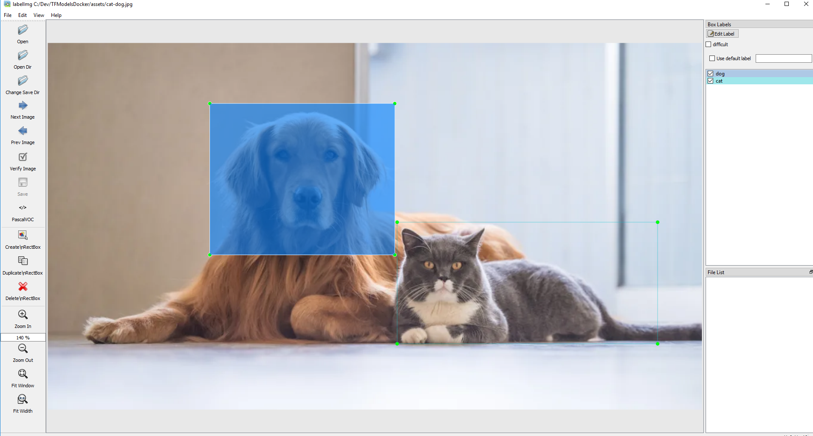

# Object Detection API Docker

This project is a Dockerfile which will build a Docker image containing the Tensorflow Object Detection API and all of it's required dependencies

## Getting Started  

### Building the Docker image  

```bash
    docker build -t tf-obj-cpu:1.14 .
```  

The previous command would build a Docker image with the name ```tf-obj-cpu``` and the version tag ```1.14```. This version tag is suitable for this image because the version of Tensorflow used is ```1.14```.  

> Note: Worth mentioning the image can be named whatever you like and given any version tag you would like  

This command will build a Docker image which can be used to build containers. This image contains Tensorflow v1.14, as well as the Tensorflow Models repository and all dependencies required to train an object detection model using their Object Detection API.  

### 📁 Preparing Workspace  

The workspace directory included in this repository contains a sample project with the correct directory structure to get started with using the Tensorflow Object Detection API.  

All projects or models you want to create in the future should contain this same directory structure in order to ensure everything runs correctly. This will be a convention based approach to rapidly develop models without having to worry about configuration.  

The directory is as follows:  

```
project-name
├─ annotations
├─ images
│   ├─ test
│   └─ train
├─ pre-trained-model
├─ training
└─ README.md 
```  

1. ```annotations```: This folder will be used to store all *.csv files and the respective TensorFlow *.record files, which contain the list of annotations for our dataset images.

2. ```images```: This folder contains a copy of all the images in our dataset, as well as the respective *.xml files produced for each one, once labelImg is used to annotate objects.

    - ```images\train```: This folder contains a copy of all images, and the respective *.xml files, which will be used to train our model.
    - ```images\test```: This folder contains a copy of all images, and the respective *.xml files, which will be used to test our model.  

3. ```output```: This folder will be the destination for our trained model upon completion of the training

3. ```pre-trained-model```: This folder will contain the pre-trained model of our choice, which shall be used as a starting checkpoint for our training job.

4. ```training```: This folder will contain the training pipeline configuration file *.config, as well as a *.pbtxt label map file and all files generated during the training of our model.  

5. ```README.md```: This is an optional file which provides some general information regarding the training conditions of our model. It is not used by TensorFlow in any way, but it generally helps when you have a few training folders and/or you are revisiting a trained model after some time.  

6. ```customlabels.py```: This is a python file which contains a sample function which looks like the following.  

    ```python
    # TO-DO replace this with label map
    # These must match the label map file in the annotations directory
    def class_text_to_int(row_label):
        if row_label == 'dog':
            return 1
        elif row_label == 'cat':
            return 2
        else:
            None 
    ```
    This file must be modified to match the labels you will be trying to identify in your object detection model. There is also a sample label map file provided in the annotations directory which will also have go be modified to match the preceeding Python file.  

    ```python
    item {
    id: 1
    name: 'dog'
    }

    item {
    id: 2
    name: 'cat'
    }
    ```  

    You will notice it is important these two files match eachother's configurations or your model will not work correctly.  

### ❗ Important Note  ❗

> To keep the source repository clean and avoid any accidental committing to the original repo, you should copy the ```project-name``` directory from inside this repository to a location on your local machine. We will later mount this copied directory into the container which is running the object detection API. Rename your copied ```project-name``` directory to a project name of your choosing. For this example I will use ```pet``` since the labels denote ```cat and dog```

### 📷 Labelling / Annotating Images  

The first step in any machine learning pipeline is preparing your training data in a way which is compatible with the model being used. For our object detection model, the images must be labelled with a bouding box surrounding the objects we are looking to detect.  

This can be done on your local machine before use of any container functionality.  

To annotate images we will be using the [labelImg](https://github.com/tzutalin/labelImg) package. Follow installation instructions, if you haven't already done so.  

> Worth noting, your overall training images should be split into two separate piles. Something like a 70-30 or 80-20 split. ```train / test```. We need to hold some images aside for evaluating the performance of our model  

Put your images inside this newly created ```pet``` dir. Training will go to ```<path>/pet/images/train``` and ```<path>/pet/images/test``` accordingly

#### Run the labelImg application  

- Select Open Dir to select your source image directory ```test or train``` 
- Change save Dir to match the source image directory 
- Select the ```Create Rect Box``` icon from the menu and drag a box around each object and specify the desired label  

  

- Click ```Save``` and this will generate an ```xml``` document with the correct labels and coordinates to the bounding box for each label. Repeat this process with both the ```testing``` and ```training``` directories until all photos are labelled  

### ✏ Editing Label Map  

This is the point where you would update the sample ```labelmap.pbtxt``` file which can be located in the ```annotations``` directory. For this example the label map is already correct. It was created for this README  

Example, if you were looking to detect basketballs and baseballs your labelmap would look like the following  

```python
    item {
        id: 1
        name: 'dog'
    }

    item {
        id: 2
        name: 'cat'
    }
``` 

### 💻 Running our container  

At this point we are ready to start leveraging the pre-built functionality which this container provides for us. We need to spin up a container from the image we created earlier and mount our newly created training data inside. 

To do this:  

```bash  
    docker run -it --name pet-detector \
    -v <path to pets dir>:/tensorflow/workspace/<name> \
    -p 8080:8080 \
    <image name> \
    /bin/bash
```  

For this example I would be swapping ```<path to pets>``` with where my pets directory is. This has to be a fully qualified path. ```NO RELATIVE PATHS```.   

- ```<name>``` - Will be the project name. For this example ```/tensorflow/workspace/pets``` would make sense  
- ```<image name>``` - Will be the tag we gave our container earlier. For this example this would be ```tf-obj-cpu:1.14```  
- ```-p 8080:8080``` - This parameter is optional, but this container has Jupyter notebooks pre-installed and also ccomes with the Tensorflow Object Detection notebook. You can go ahead and run Jupyter notebooks and run this notebook to ensure everything is working correctly. The ```-p 8080:8080``` forwards port ```8080``` from inside the container to ```8080``` on your host machine. The password for the ```root``` user is ```root```.  

If all went as planned, you should now see a bash prompt from inside the container. If you run ```pwd``` it should show something like ```/tensorflow/models/research```. If you ```cd``` back a few directories you should see your ```pets``` directory. This will be your local folder mounted into the container. Any changes made on your local machine to the files in this directory, will also be reflected inside the container


## ❗ The following steps will all be completed inside the container ❗

### 📝 Creating TensorFlow Records  

Now that we have generated our annotations and split our dataset into the desired training and testing subsets, it is time to convert our annotations into the so called ```TFRecord``` format.  

There are two steps in doing so:

- Converting the individual *.xml files to a unified *.csv file for each dataset.
- Converting the *.csv files of each dataset to *.record files (TFRecord format)  

Included in this repository is some scripts which will handle this functionality for you.  

> Again! Directory structure is important here, as these scripts are written assuming files are located in certain locations. Follow this guide and you should have no issues  

There are two steps to converting to TFRecords:  

    1. Convert the individual .xml files to one unified csv file for each dataset test and train
    
    2. Convert the csv files for each dataset into .record files  

#### Converting .xml to .csv  

There are a few scripts inside the ```/tensorflow/scripts``` directory. These scripts are pre written to perform these tasks. To perform the conversion run the ```xml_to_csv.py``` python script passing in the project name as a parameter. ```-p <project name>``` project name being whatever name you gave the directory you mounted uner ```/tensorflow/workspace/<project name>```. For this example we used ```pets```

```python
    python /tensorflow/scripts/xml_to_csv.py --project pets
```  

Upon completion of this script, you should get a message saying files were successfuly converted to csv.  

#### Converting from .csv to .record  

The following ```generate_tfrecord.py``` script is also located in ```/tensorflow/scripts```. The process of running this will be very similar to the previous step.   

> Note unlike the previous step which accepted a simple -p parameter. The following script accepts the fully qualified --project. This is due to Tensorflow performing the agument parsing, as oppose to the core Python argument parser.  

```python
    python /tensorflow/scripts/generate_tfrecord.py --project pets
```  

Again passing in the name of the folder created under ```workspace``` as the project name argument. Upon completion of this script you will be shows a confirmation message in the console that the record files have been generated 

## ❗ The following step can be completed on the local machine (outside container) ❗

### ⚙ Configuring Training Pipeline  

For the purposes of this README we will not be creating a training job from the scratch, but rather we will go through how to reuse one of the pre-trained models provided by TensorFlow. If you would like to train an entirely new model,you can have a look at [TensorFlow’s tutorial](https://github.com/tensorflow/models/blob/master/research/object_detection/g3doc/configuring_jobs.md).

The model we shall be using in our examples is the ssd_inception_v2_coco model, since it provides a relatively good trade-off between performance and speed, however there are a number of other models you can use, all of which are listed in [TensorFlow’s detection model zoo](https://github.com/tensorflow/models/blob/master/research/object_detection/g3doc/detection_model_zoo.md). More information about the detection performance, as well as reference times of execution, for each of the available pre-trained models can be found [here](https://github.com/tensorflow/models/blob/master/research/object_detection/g3doc/detection_model_zoo.md#coco-trained-models-coco-models).
 
Once the ```*.tar.gz``` file has been downloaded, open it using a decompression program of your choice (e.g. 7zip, WinZIP, etc.). Next, open the folder that you see when the compressed folder is opened (typically it will have the same name as the compressed folded, without the ```*.tar.gz``` extension), and extract it’s contents inside the folder ```training_demo\pre-trained-model```.  

There should be a file ending in ```.config``` contained inside of the extracted directory. The file included in the model selected for this example is called ```pipeline.config```. This file should be renamed to ```model.config``` and moved to the ```training``` directory inside your project directory. At this point our ```/tensorflow/workspace/pets/pre-trained-models``` directory should contain the contents of the ```.tar``` file without the ```pipeline.config```. The ```/tensorflow/workspace/pets/training``` directory should contain our newly moved ```model.config``` file.

## ❗ The configuration will vary based on model selected ❗  

For the purpose of this example, using the selected model we will change the following configuration values. Open up the ```model.config``` file with the editor of your choice.  

> Note: As long as we have our folder mounted into the running docker container, any changes made to files on our local machine to this mounted folder will be reflected inside the container. This will allow for ease of editing this config file without having to use a console based editor within the container.  

- **num_classes**: This value should be changed to the number of objects we are trying to identify. For our examples it would be ```2```. Our labels are ```cat``` and ```dog```  
- **fine_tune_checkpoint**: This value will be changed to the following ```/tensorflow/workspace/pets/pre-trained-model/model.cpkt```. For your example change pets to the project name.  
- **train_input_reader**. There will be a couple changes to make under this section. 
    - input_path: This will be the path to our training .record ```/tensorflow/workspace/pets/annotations/train.record```  
    - label_map_path: This will be the path to out labelmap file. ```/tensorflow/workspace/pets/annotations/labelmap.pbtxt```  
- **num_examples**: Change this value to the number of images you have in the ```/tensorflow/workspace/pets/images/test``` directory. This will be the number of testing examples we have  
- **eval_input_reader**. There will be a couple changes to make under this section. 
    - input_path: This will be the path to our test .record ```/tensorflow/workspace/pets/annotations/test.record```  
    - label_map_path: This will be the path to out labelmap file. ```/tensorflow/workspace/pets/annotations/labelmap.pbtxt```  

Save the file and we are ready to train the model.  

## 💡 Training the Model  

The final step of the process is to run our training. There is one last script in the scripts directory which will perform this task. To run the script run the following command.  

```python
    python /tensorflow/scripts/train.py --logtostderr --project pets
```  

Swap ```pets``` with your project name.  

If all is configured correctly you should see output which resembles the following:  

```
INFO:tensorflow:global step 1: loss = 13.8886 (12.339 sec/step)
INFO:tensorflow:global step 2: loss = 16.2202 (0.937 sec/step)
INFO:tensorflow:global step 3: loss = 13.7876 (0.904 sec/step)
INFO:tensorflow:global step 4: loss = 12.9230 (0.894 sec/step)
INFO:tensorflow:global step 5: loss = 12.7497 (0.922 sec/step)
INFO:tensorflow:global step 6: loss = 11.7563 (0.936 sec/step)
INFO:tensorflow:global step 7: loss = 11.7245 (0.910 sec/step)
INFO:tensorflow:global step 8: loss = 10.7993 (0.916 sec/step)
INFO:tensorflow:global step 9: loss = 9.1277 (0.890 sec/step)
INFO:tensorflow:global step 10: loss = 9.3972 (0.919 sec/step)
INFO:tensorflow:global step 11: loss = 9.9487 (0.897 sec/step)
INFO:tensorflow:global step 12: loss = 8.7954 (0.884 sec/step)
INFO:tensorflow:global step 13: loss = 7.4329 (0.906 sec/step)
INFO:tensorflow:global step 14: loss = 7.8270 (0.897 sec/step)
INFO:tensorflow:global step 15: loss = 6.4877 (0.894 sec/step)
```  

## ❗ Tensorboard (Optional)  

> Note: The following steps will have to be completed on a local machine. Unless you have forwarded ports from the container out to your local machine. Forwarding the ports can be done using ```-p <container port>:<host port>``` when initiating the ```docker run``` command at the start of this tutorial.  The default port for Tensorboard is ```6006```

If you would like to see a graphical display of the training progress, you can use ```Tensorboard``` to do so.  

Activate a Python environment which has Tensorflow installed in it and run the following command:  

Steps from within the container  

```  
    tensorboard --logdir=/tensorflow/workspace/pets/training/
```  
> Swap pets with your project name  

Steps from host machine (outside container)  

``` 
    tensorboard --logdir=c:\mydir\pets  
```  

> Swap c:\mydir\pets with the path to the mounted folder on your host machine  

You should see the following output ```TensorBoard 1.6.0 at http://YOUR-PC:6006 (Press CTRL+C to quit)```  

Open a browser and navigate to ```http://localhost:6006```. You should be presented with a dashboard containing training metrics.  

## 🖥 Exporting a Trained Inference Graph  

Once your training job is complete, you need to extract the newly trained inference graph, which will be later used to perform the object detection. This can be done as follows:  

- Check inside your ```pets/training``` folder for the ```model.ckpt-*``` checkpoint file with the highest number following the name of the dash e.g. model.ckpt-34350). This number represents the training step index at which the file was created.

- Alternatively, simply sort all the files inside ```pets/training``` by descending time and pick the ```model.ckpt-*``` file that comes first in the list.

- Make a note of the number at the end of the file’s name, as it will be passed as an argument when we call the ```export_inference_graph.py``` script.

- Now, run the following command:  

```
python /tensorflow/scripts/export_inference_graph.py --input_type image_tensor --step <number from last step> --project pets
```  

This should run and in the ```output``` directory will be the frozen inference graph which can be used for future object detection  

A large portion of this guide was made using material found [here](https://tensorflow-object-detection-api-tutorial.readthedocs.io/). This is a great tutorial for getting going with Tensorflow object detection  